# IBM Cloud Code Engine project deployable architecture

This deployable architecture creates IBM Cloud Code Engine project and the following optional resources:

- A resource group.
- Code Engine project build.
- Code Engine project secrets.
- Code Engine project configmaps.
- Code Engine project domain mappings.

